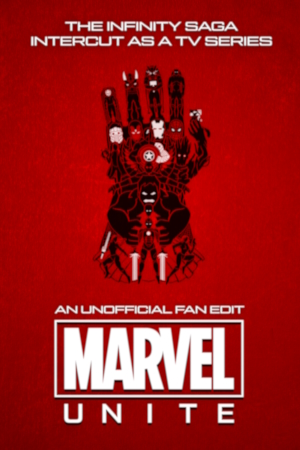

# About

**Marvel: Unite** takes the MCU Infinity Saga films and splits them into a TV series format with hour-long episodes. Each episode has a multi-narrative structure featuring scenes from various different movies, all inter-cut together. The series roughly tries to mirror the theatrical experience, with the films placed in their intended release order with little content added or removed, just restructured to be more approachable and more "binge-able."

  
## Intentions

**My main goal is to make the MCU _more_ approachable, not _less_.** All of the movies are neatly interwoven in hour-long chunks. Nobody has to dedicate an entire evening solely to watching weaker MCU films like Thor: The Dark World. Instead, Inter-cutting between the various narratives allows them each to breathe and keeps everything fresh.

Plot points are revealed in more or less the way they were meant to be revealed, with the films roughly following release order. Many MCU edits I've found are in chronological order, which die-hard fans may find interesting, but I don't think it's the overall best way to watch it. Why watch 2 straight hours of Captain Marvel at the very beginning when she isn't relevant again until 50 hours later in Endgame?

There are also very few deleted scenes or extras added. My intention is less to expand on or to fix the MCU, but rather to just reformat the content everyone already loves. Plotlines are occasionally shifted for pacing or to make the episodic format more cohesive.

A lot of attention was given towards giving each episode a cohesive arc with proper pacing. I also focused a lot on high-quality sourcing and a proper rendering pipeline, using the UHD Blu-rays to create a 4K HDR version with lossless 5.1 audio.

## Version Guide

| **Resolution** | **Bitrate** | **Codec** | **Audio**    | **Quality** | **Description** |
| :---: | :---: | :---: | :---: | :---: | :--- |
| 2160p | 24 Mbps | x265 MKV | 5.1 DTS-HD MA 5.1 AC3 | Excellent | Best for home theater setups and where file size isn't a concern. Lossless audio has higher dynamic range for high-end audio setups. |
| 2160p | 12 Mbps | x265 MKV | 5.1 AAC | Great | Quality is only slightly degraded, yet has less than half the file-size. |
| 1080p | 6 Mbps | x265 MKV | 5.1 AAC | Great | Recommended 1080p version if your device supports x265/HEVC playback. |
| 1080p | 8 Mbps | x264 MP4 | 5.1 AC3 2.0 AAC | Good | Recommended 1080p version for ultimate compatibility. |
| 1080p | 2.5 Mbps | x264 MP4 | 2.0 AAC | Decent | This version is created primarily for streaming in-browser. |

## How to Watch

The lowest bitrate version of Marvel: Unite can be streamed through archive.org, and higher quality versions are available by torrent.

**Use the season links on the left sidebar for either option.**

## Special Thanks
* My wife <3

###### IFDB
* ArtisDead
* INIGHTMARES
* NOTFLIX
* lantern51

###### Reddit
* u/colddeaddrummer
